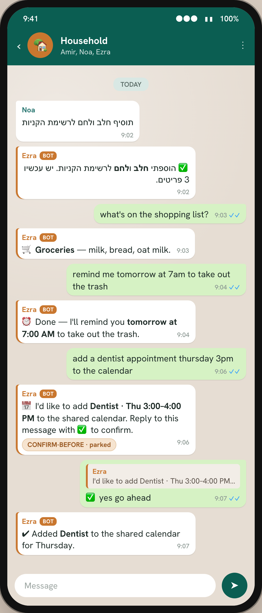
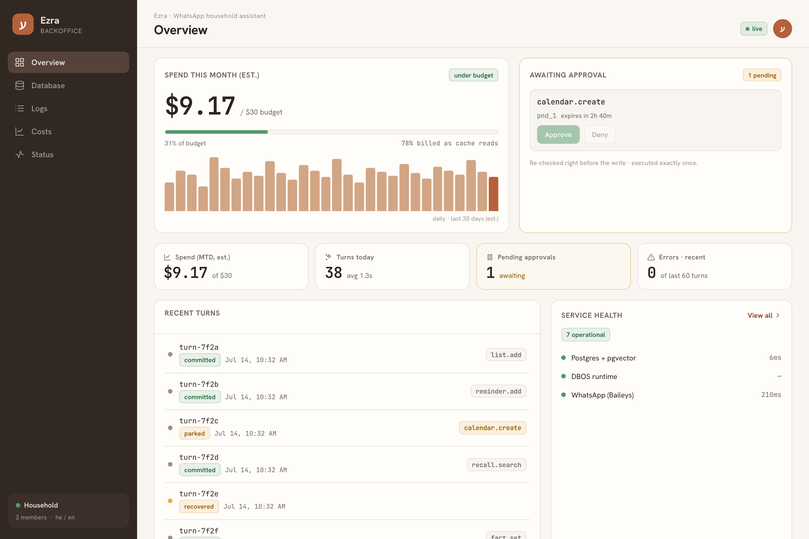
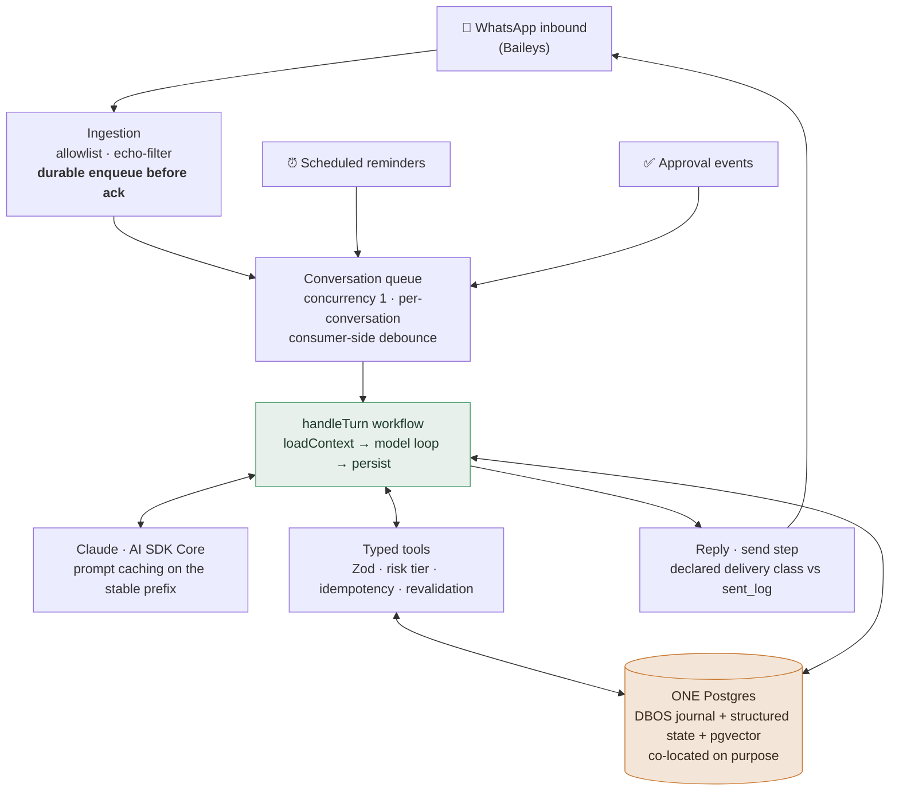
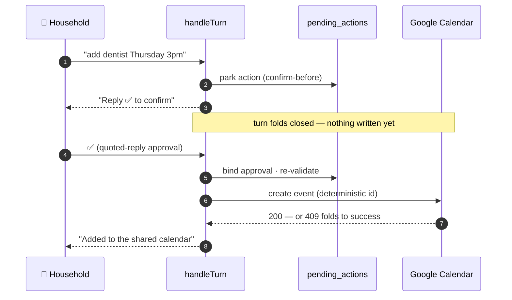
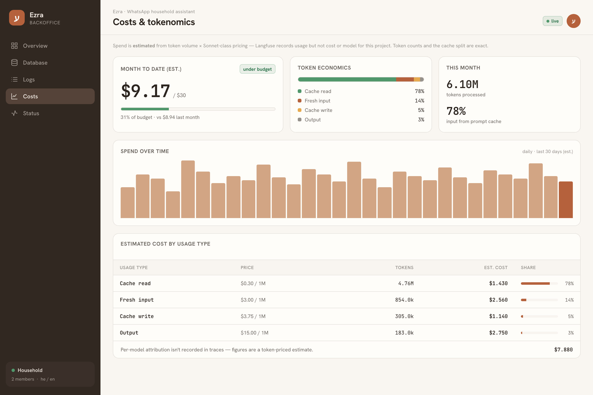
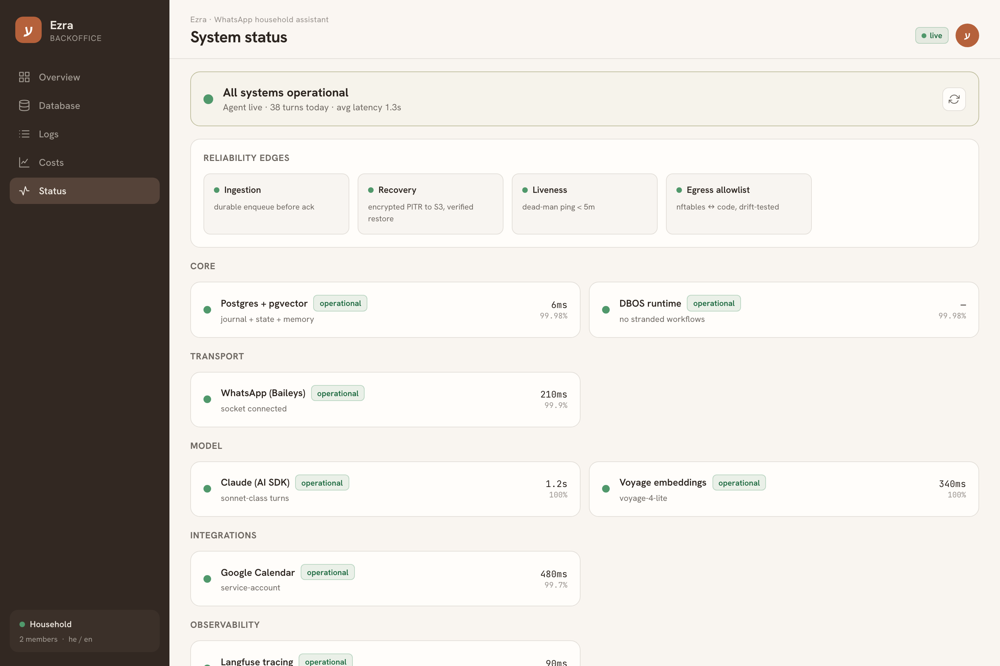
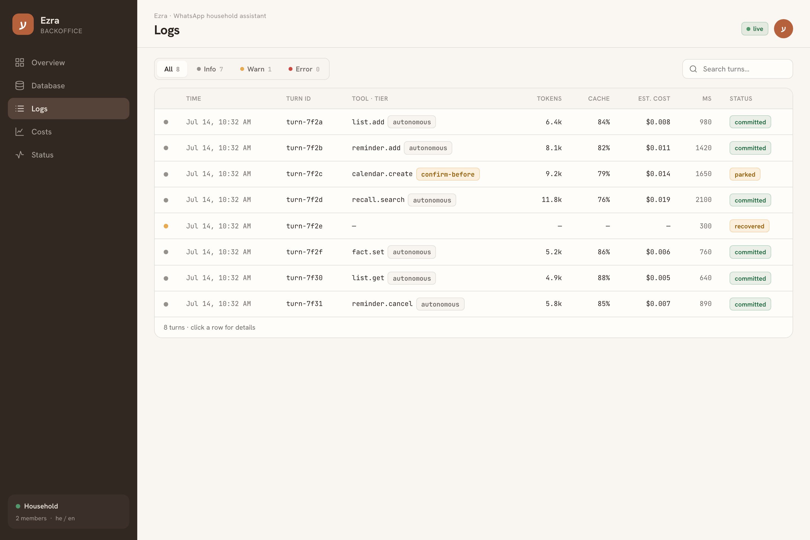
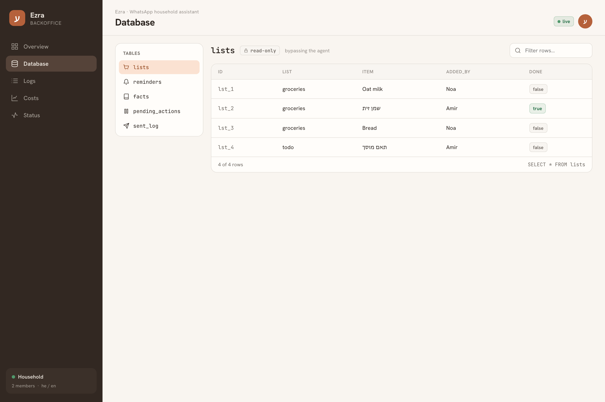

<p align="center">
  
</p>

<p align="center">
  <a href="https://github.com/shem86/ezra/actions/workflows/ci.yml"></a>
  
  
  
  
  
  
  
  
</p>

**Ezra** (עזרא — Hebrew for *help*) is a WhatsApp assistant for a two-person
household: reminders, shared lists, Google Calendar, and memory-backed household
Q&A, in mixed Hebrew and English. It is **live**, running on a hardened cloud
host against the real family WhatsApp group — built as a production-grade
exercise in reliable agentic systems.

> The LLM is the easy 10%. This repo is about the other 90%: the durable harness
> around the model, the guardrails that constrain what it can do, how you
> evaluate something nondeterministic, and the reliability work that keeps a tool
> a second person actually depends on from failing *silently*.

---

## See it in action

<table>
<tr>
<td width="42%" valign="top">

A real household thread — code-switching between Hebrew and English, adding to a
shared list, setting a reminder, and a calendar write that **parks for human
approval** before it touches anything third-party-visible.

Ezra answers as a group member. Risky actions don't just execute — they ask, and
resume in a fresh turn when a household member replies ✅.

</td>
<td width="58%" valign="top">
<p align="center">
  
</p>
</td>
</tr>
</table>

And a read-only **operations console** to watch the live system — what it did,
what it knows, what it costs, and whether it's healthy:

<p align="center">
  
</p>

<sub>↑ Overview: month-to-date spend, pending approvals, recent turns, and service health. More screens in <a href="#the-operations-console">The operations console</a> below.</sub>

---

## What's interesting here

This is, first, an exercise in **AI architecture and engineering** — how you
actually build a production-grade LLM agent: the harness around the model, the
context you feed it, how you evaluate something nondeterministic, and the
discipline that keeps all of it honest. And because it's a *live* tool a second
person depends on, it's also a study in **durable execution and reliability** —
an agent that fails silently is worse than one that crashes loudly.

> **A favourite bug: the model had no clock.** Its training anchor made "today"
> feel like mid-2025, so "remind me in 5 minutes" resolved months into the past
> and fired instantly — a silent success. The fix pushes real wall-time into
> every turn (cache-safe), the way Claude's own system prompt injects the current
> date.

<details>
<summary><b>🧠 Building the agent</b> — a harness, not a framework; non-blocking HITL; cache-aware context</summary>

<br />

- **A harness, not a framework.** The agent loop is owned by durable workflow
  code, *not the AI SDK* — tools run as journaled steps, not SDK-driven calls —
  so the orchestration is mine to reason about and recover. Tools are defined
  through one typed registry (Zod schema, risk tier, idempotency key,
  revalidation hook), and the loop guarantees every `tool_use` is answered and
  bounds its own rounds.
- **Human-in-the-loop, non-blocking.** Risky actions (calendar writes) *park*
  instead of executing and fold the turn closed; a quoted-reply approval resumes
  them in a fresh turn, re-checked right before the write and executed exactly
  once even if both people approve at once. Approve/deny is decided by
  deterministic Hebrew/English keywords — **no model in the decision** — and a
  small classifier only routes the ambiguous middle (refine / unrelated).
- **Context management.** A byte-stable system-prompt prefix lets prompt caching
  work; per-turn dynamic state (a pending-actions digest, the current wall-clock)
  appends strictly after it. Long transcripts compact into an embedded summary
  that keeps open commitments verbatim, and history is recalled pull-only through
  a vector-search tool.
- **Engineering discipline.** Strict TypeScript, Zod at every boundary,
  dependency injection over singletons, exact-pinned dependencies, and a custom
  lint rule that fails CI on nondeterminism inside a workflow body.

</details>

<details>
<summary><b>🛡️ Guardrails</b> — constrained by construction, not by asking the prompt nicely</summary>

<br />

The agent acts on a shared household's behalf, so what it's *allowed* to do is
constrained by construction:

- **Risk-tiered tools.** Every tool declares a tier — autonomous (reversible,
  household-internal), notify-after, or confirm-before. Anything
  third-party-visible (calendar writes) is confirm-before and **cannot
  auto-execute**: it parks for human approval, enforced in code, not left to the
  model's judgment.
- **Scoped to one conversation.** Ingestion rejects any chat that isn't the
  allowlisted household group — the agent never answers strangers, and no outside
  message can drive a tool.
- **Schema-validated I/O.** Zod validates every inbound message, tool argument,
  and model output; a malformed or hallucinated tool call becomes an error result
  the loop handles, never an exception or an unintended side effect.
- **Bounded and conservative by default.** The loop is capped with a forced final
  answer (no runaway tool calls), and ambiguous safety calls fail toward the safe
  side — an unclear approval re-asks rather than acting, an unclassifiable send
  retries rather than silently dropping a reminder.

</details>

<details>
<summary><b>📊 Measurement &amp; evaluation</b> — behavioral evals, tracing, and tokenomics that drove design</summary>

<br />

Testing a nondeterministic agent needs more than unit tests:

- **Behavioral evals.** Model-in-the-loop behaviour runs through an on-demand
  eval harness whose approval scenarios assert on **resulting state, never reply
  wording**, with a separate accuracy dashboard for the relatedness classifier —
  what makes a nondeterministic agent gateable at all.
- **Tracing & observability.** Every durable step emits a Langfuse span — model
  rounds with full token usage (cache reads/writes), tool calls with their risk
  tier — so cost and behaviour are inspectable per turn. Trace callbacks never
  throw into the workflow.
- **Tokenomics.** Per-turn cost is measured from those traces on scripted days
  and gated against a budget — it lands **~$9/mo with 78% of input billed as
  cache reads**, re-checked against live traffic. Measurement drove design:
  [one decision](docs/adr-0003-remove-turn-router.md) *removed* a cheap/expensive
  model router once the numbers showed it forfeited the prompt cache for no real
  saving.

</details>

<details>
<summary><b>🔧 Keeping it reliable</b> — durability targeted at the five edges where a live tool fails quietly</summary>

<br />

A live household tool fails at its *edges*, quietly, so the durability work
targets five of them:

- **Ingestion** — an inbound message is durably enqueued *before* it's acked;
  a crash in that window replays from WhatsApp's redelivery, and dedupe makes the
  replay safe.
- **Durable execution** — turns are short-lived durable workflows on
  [DBOS](https://www.dbos.dev/); each state write co-commits with its journal
  checkpoint in one Postgres transaction, so recovery is exactly-once. A
  kill-mid-flight suite SIGKILLs a turn and proves identical output, every effect
  once.
- **External effects** — calendar events get a deterministic id, so a replayed
  create folds Google's 409 to success instead of double-booking; outbound
  messages are classified at-least-once vs at-most-once against a send log.
- **Recovery** — encrypted point-in-time backups to S3 with asymmetric keys (the
  host can't decrypt its own backups); restoring is mechanical reconciliation,
  not judgment.
- **Liveness** — an independent alert channel that doesn't depend on the
  WhatsApp socket it's watching.

**Security & operations.** Credentials never reach the model — by construction
and by CI: secrets stay out of prompts, traces, and the vector store, and the
egress allowlist is unit-tested, so a dependency that dials an unlisted host
turns CI red. The runtime is a non-root, read-only-rootfs container on a hardened
host.

</details>

## How it works

Three event sources — human messages (debounced), scheduled reminders, and
approval events — all enqueue into a **single concurrency-1 lane keyed by the
conversation**. Tasks co-exist as durable state; they never co-execute.



Memory is split: a structured store (lists, reminders, facts, pending actions)
and a pull-only **pgvector** semantic recall tool
([Voyage](docs/adr-0002-voyage-embeddings.md) embeddings); a compaction step
folds long transcripts into an embedded summary while keeping open commitments
verbatim.

### Human-in-the-loop: a calendar write, parked

A confirm-before tool never auto-executes. It parks, folds the turn closed, and
only resumes when a household member replies to approve — re-validated right
before the write and executed exactly once:



## The operations console

A single-operator, **read-only** web console (`backoffice/` — Vite + React,
Hebrew/English-aware) sits over the live system as an *observatory*: what it did,
what it knows, what it costs, and whether it's healthy. Zero write paths reach
the UI; it's exposed only over a private Tailscale tailnet, never a public port.
See [`docs/backoffice-spec.md`](docs/backoffice-spec.md).

<table>
<tr>
<td width="50%"><br /><sub><b>Costs &amp; tokenomics</b> — MTD spend vs budget, the cache-read split, and estimated cost by usage type. The design that keeps it at ~$9/mo, made visible.</sub></td>
<td width="50%"><br /><sub><b>System status</b> — live probes across core / transport / model / integrations, plus the five reliability edges.</sub></td>
</tr>
<tr>
<td width="50%"><br /><sub><b>Logs</b> — per-turn journal enriched from traces: tool, risk tier, tokens, cache %, cost, and workflow status.</sub></td>
<td width="50%"><br /><sub><b>Database</b> — read-only tour of the structured store: lists, reminders, facts, pending actions.</sub></td>
</tr>
</table>

<sub>Screens above are rendered from fabricated, non-PII fixtures via
<a href="backoffice/scripts/mock-shots.mjs"><code>backoffice/scripts/mock-shots.mjs</code></a> —
the real console shows the household's live data behind auth.</sub>

## Project status — **live (v1)**

All milestones M0–M6 are complete; the
[launch checklist](docs/launch-checklist.md) closed every SPEC success criterion
with evidence.

| Milestone | Gate | Status |
|---|---|---|
| M0 — Scaffold (TS/pnpm/Vitest/ESLint/CI/dev DB) | CI green end-to-end | ✅ done |
| M1 — De-risking spikes | caching + DBOS semantics proven | ✅ done |
| M2 — Transport adapter + ops monitoring | alert + dead-man drills | ✅ done |
| M2.5 — Host + encrypted backups | verified restore | ✅ done |
| M3 — Durable core | `pnpm test:recovery` green | ✅ done |
| M4 — Reasoning layer | all tools exercised, cost ≤ $30/mo | ✅ done (~$9/mo) |
| M5 — HITL approval flows | five approval scenarios pass | ✅ done (8/8) |
| M5.5 — Calendar | real-wire round-trip gate | ✅ done |
| M6 — Wire-up and launch | SPEC success checklist swept | ✅ **live** |

Live on a hardened AWS EC2 host with continuous PITR backups; ~7k lines of
strict TypeScript, 57 test files (598 unit + integration, plus a dedicated
recovery gate). Task-level history: [`TASKS.md`](TASKS.md). Spike verdicts and
pinned versions: [`docs/spike-results.md`](docs/spike-results.md).

## Getting started

Prerequisites: Node 22+, pnpm 10, Docker (Colima works).

```bash
pnpm install
docker compose up -d          # one Postgres with pgvector on :5432
cp .env.example .env          # fill in keys (never committed)

pnpm build                    # tsc, strict
pnpm lint                     # eslint incl. the custom DBOS-determinism rule
pnpm test                     # unit only without DATABASE_URL…
DATABASE_URL=postgres://hh:hh@localhost:5432/hh_assistant pnpm test   # …+ integration
pnpm test:recovery            # kill-mid-flight replay gate
```

Spikes run directly under Node 22's type stripping:

```bash
node --env-file=.env spikes/cache-control.ts   # prompt-caching proof
```

The operations console is its own workspace:

```bash
cd backoffice && pnpm install && pnpm dev       # Vite dev server on :5173
node scripts/mock-shots.mjs                      # regenerate the README screenshots
```

CI (GitHub Actions) runs build + lint + the full test suite against a pgvector
service container on every push and PR. Model calls, real WhatsApp traffic, and
real calendar writes never run in CI.

<details>
<summary><b>Repository layout</b></summary>

<br />

```
src/transport/      Baileys socket, ingestion, send classes, sent-log
src/orchestration/  DBOS workflows, queue, debounce, scheduled jobs, recovery
src/agent/          handleTurn loop, prompts, compaction, call-model
src/tools/          typed tool definitions: Zod, risk tiers, idempotency, calendar
src/memory/         structured store + pgvector semantic store + embedder
src/hitl/           pending_actions, park, approval binding, refine, TTL expiry
src/ops/            config/secrets, health, alerts, dead-man, tracing, egress
src/main.ts         production composition (Baileys + DBOS + Claude)
eslint-rules/       custom rule: no nondeterminism in workflow bodies
spikes/             de-risking + real-wire smoke scripts
infra/              host provisioning, hardened compose, egress nftables, backups
backoffice/         read-only ops console (Vite + React, own workspace)
tests/              unit + integration (integration gated on DATABASE_URL)
evals/              model-in-the-loop evals: approval scenarios + compaction
                    summary quality (on-demand)
docs/               ADRs, spike results, runbooks, drill logs, launch checklist
```

</details>

<details>
<summary><b>Documentation map</b></summary>

<br />

| Document | What it owns |
|---|---|
| `household-ai-agent-architecture-v3_5.md` | **Why** — the locked architecture decisions |
| [`SPEC.md`](SPEC.md) | **What/how** — scope, conventions, boundaries, success criteria |
| [`docs/adr-0001-remove-secret-fact-class.md`](docs/adr-0001-remove-secret-fact-class.md) | Why the user-facing secret-fact class was dropped |
| [`docs/adr-0002-voyage-embeddings.md`](docs/adr-0002-voyage-embeddings.md) | Why Voyage + a zero-dependency fetch client for embeddings |
| [`docs/adr-0003-remove-turn-router.md`](docs/adr-0003-remove-turn-router.md) | Why the tiered cheap/reasoning turn router was removed |
| [`docs/adr-0004-service-account-calendar.md`](docs/adr-0004-service-account-calendar.md) | Why a shared-calendar service account over OAuth consent |
| [`docs/backoffice-spec.md`](docs/backoffice-spec.md) | The read-only operations console — scope, exposure, screens |
| [`docs/launch-checklist.md`](docs/launch-checklist.md) | SPEC success criteria, each box closed with evidence |
| [`docs/recovery-runbook.md`](docs/recovery-runbook.md) | The four loss scenarios + mechanical reconciliation |
| [`docs/spike-results.md`](docs/spike-results.md) | Spike verdicts, version pins, gotchas |
| [`docs/compaction-eval-spec.md`](docs/compaction-eval-spec.md) | How transcript compaction is captured + evaluated (summary quality) |
| [`CLAUDE.md`](CLAUDE.md) + `.claude/rules/` | Working agreements for AI-assisted sessions |

Build history lives in [`PLAN.md`](PLAN.md) (milestones M0–M6) and
[`TASKS.md`](TASKS.md) (the dependency-ordered task list with per-task
done-notes).

</details>

## Stack

Node 22 · TypeScript (strict) · pnpm (exact pins) · DBOS 4.19.8 ·
Postgres + pgvector · Vercel AI SDK Core + Claude (Sonnet-class reasoning,
Haiku-class classification) · Voyage embeddings (voyage-4-lite) · Baileys ·
Langfuse · Vitest · ESLint (flat config + custom determinism rule) ·
GitHub Actions · age-encrypted PITR to S3 · host nftables egress allowlist.
Operations console: Vite · React · TypeScript, exposed over Tailscale.

All dependency versions are pinned exact; the DBOS and AI SDK pins are the
versions the M1 spikes validated — bumps require re-running those suites.
